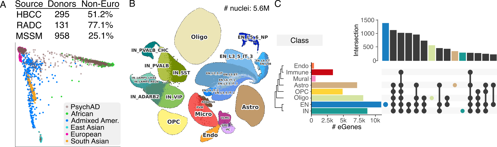

# Single nucleus, multi-ancestry atlas of genetic regulation of gene expression in the human brain 

[Biao Zeng](https://profiles.icahn.mssm.edu/biao-zeng), et al., [Gabriel E. Hoffman](https://gabrielhoffman.github.io)# , [Panos Roussos](https://icahn.mssm.edu/research/neurogenomics)# 

# indicates co-senior authors

Correspondence to:  P.R. (panagiotis.roussos@mssm.edu),  G.E.H. (gabriel.hoffman@mssm.edu)

Genetic risk variants for common diseases are predominantly located in non-coding regulatory regions and modulate gene expression. Although bulk tissue studies have elucidated shared mechanisms of regulatory and disease-associated genetics, the cellular specificity of these mechanisms remains largely unexplored. This study presents a comprehensive single-nucleus multi-ancestry atlas of genetic regulation of gene expression in the human prefrontal cortex, comprising 5.6 million nuclei from 1,384 donors of diverse ancestries. Through multi-resolution analyses spanning eight major cell classes and 27 subclasses, we identify genetic regulation for 14,258 genes, with 857 showing cell type-specific regulatory effects at the class level and 981 at the subclass level. Colocalization of genetic variants associated with gene regulation and disease traits uncovers novel cell type-specific genes implicated in Alzheimer’s disease, schizophrenia, and other disorders, which were not detectable in bulk tissue analyses. Analysis of dynamic genetic regulation at the single nucleus level identifies 2,073 genes with regulatory effects that vary across developmental trajectories, inferred from a broad age range of donors. We also uncover 1,655 genes with trans-regulatory effects, revealing distal regulation of gene expression. This high-resolution atlas provides unprecedented insight into the cell type-specific regulatory architecture of the human brain, and offers novel mechanistic targets for understanding the genetic basis of neuropsychiatric and neurodegenerative diseases.

&nbsp;
&nbsp;
&nbsp;

## eQTL Analysis of PsychAD single nucleus RNA-seq

<b>Figure 1.  Genetic regulation of gene expression at the cell-type level.</b> 
<b>A</b>) Genetic ancestry of 1384 total donors by brain bank.  Tissue specimens were obtained from Human Brain Collection Core (HBCC), Rush Alzheimer's Disease Center (RADC), Mount Sinai School of Medicine (MSSM).  <b>B</b>) UMAP plot of 5.6M nuclei annotated for 27 cell subclasses.  <b>C</b>) Upset plot for number of eGenes detected for each class along with counts of eGenes detected in multiple classes or subclasses.

- Results available on [Synapse](https://www.synapse.org/Synapse:syn61929918/wiki/629719)

Analysis code [folder](https://github.com/DiseaseNeuroGenomics/nps_ad/tree/master/analysis/freeze2)

 - analysis of eQTL summary statistics [code](https://github.com/DiseaseNeuroGenomics/nps_ad/tree/master/analysis/freeze2/eQTL)
- analysis with [dreamlet](https://diseaseneurogenomics.github.io/dreamlet/) [code](https://github.com/DiseaseNeuroGenomics/nps_ad/blob/master/analysis/freeze2/testing/run_dreamlet_contrasts.Rmd)
- analysis with [crumblr](https://diseaseneurogenomics.github.io/crumblr/) [code](https://github.com/DiseaseNeuroGenomics/nps_ad/blob/master/analysis/freeze2/testing/run_crumblr_contrasts.Rmd)
 
 
 
 
 
 
 
 
 